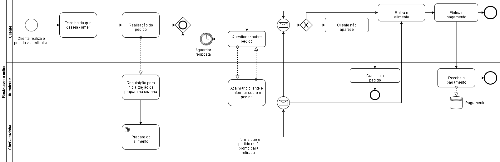

# Especificações do Projeto

Muitos restaurantes que oferecem a opção de drive-thru possuem um serviço que é caracterizado por ser o oposto do que é pensado para ser: rápido. Esse gargalo de tempo entre o pedido e a entrega prejudicam a satisfação do cliente. Por outro lado tem-se a opção de não esperar no carro ao pedir comida por aplicativos de entrega. Nesse caso, espera-se em casa. O drive-tru planejado aqui visa solucionar esses gargalos. O usuário do sistema poderá realizar o seu pedido com antecedência e ir buscá-lo quando souber que já está pronto, agilizando o serviço. Muitas features serão adicionadas de forma a auxiliar o dia a dia do restaurante, fornecendo dados para funcionários e gerente de acordo com as demandas do trabalho de cada um.

Abaixo são apresentadas as personas, histórias de usuários e requisitos planejados para o drive-thru.

## Personas

## Histórias de Usuários

Com base na análise das personas forma identificadas as seguintes histórias de usuários:

|EU COMO... `PERSONA`| QUERO/PRECISO ... `FUNCIONALIDADE` |PARA ... `MOTIVO/VALOR`                 |
|--------------------|------------------------------------|----------------------------------------|
|Consumidor | Comprar online e retirar meu pedido quando ele já estiver pronto | Ter comida fresca e de qualidade sem que para isso eu precise cozinhar |
|Consumidor | Poder efetuar minha compra de casa mesmo que eu me dirija até o restaurante | Não ter que esperar pelo garçom e poder eu mesmo acompanhar o status do meu pedido |
|Funcionário| Efetuar o pedido do cliente usando o sistema do restaurante | Atender o cliente usando a mesma base de dados usada pelo pessoal da cozinha e gerencia podendo atender dentro das regras de negócio |
|Funcionário| Acompanhar o status do pedido do cliente| Buscar o prato do cliente e saber responder àqueles que me perguntam sobre o status do pedido |
|Gerente | Um sistema integrado para o restaurante | cozinheiros, funcionários e consumidores tenham acesso ao mesmo estoque de produtos para evitar falta de insumos e para que todas as movimentações financeiras fiquem centralizadas em um mesmo lugar|
|Gerente | Gerar relatórios financeiros |Identificar como anda o faturamento do restaurante e tomar decisões gerenciais a respeito |
|Gerente | Cadastrar e descadastrar a quantidade de cada prato disponível de acordo com os ingredientes que tenho em estoque | Evitar que um cliente faça um pedido que não possa ser atendido |
|Gerente | Gerar relatórios do estoque do restaurante | Planejar as compras semanais |

## Modelagem do Processo de Negócio 

### Análise da Situação Atual

Apresente aqui os problemas existentes que viabilizam sua proposta. Apresente o modelo do sistema como ele funciona hoje. Caso sua proposta seja inovadora e não existam processos claramente definidos, apresente como as tarefas que o seu sistema pretende implementar são executadas atualmente, mesmo que não se utilize tecnologia computacional. 

### Descrição Geral da Proposta

Apresente aqui uma descrição da sua proposta abordando seus limites e suas ligações com as estratégias e objetivos do negócio. Apresente aqui as oportunidades de melhorias.

### Compra de produto

Apresente aqui o nome e as oportunidades de melhorias para o processo 1. Em seguida, apresente o modelo do processo 1, descrito no padrão BPMN. 

## Indicadores de Desempenho

Apresente aqui os principais indicadores de desempenho e algumas metas para o processo. Atenção: as informações necessárias para gerar os indicadores devem estar contempladas no diagrama de classe. Colocar no mínimo 5 indicadores. 

Usar o seguinte modelo: 

Obs.: todas as informações para gerar os indicadores devem estar no diagrama de classe a ser apresentado a posteriori. 

## Requisitos

As tabelas que se seguem apresentam os requisitos funcionais e não funcionais que detalham o escopo do projeto. Para determinar a prioridade de requisitos, aplicar uma técnica de priorização de requisitos e detalhar como a técnica foi aplicada.

### Requisitos Funcionais

|ID    | Descrição do Requisito  | Prioridade |
|------|-----------------------------------------|----|
|RF-001| Permitir que o gerente cadastre tarefas | ALTA | 
|RF-002| Emitir um relatório de tarefas por periodo   | MÉDIA |
|RF-003| Os 3 tipos de usuários poderão realizar login no sistema   | ALTA |
|RF-004| Os 3 tipos de usuários poderão consultar e alterar dados pessoais de acordo com as regras de negócio.  | MÉDIA  |
|RF-005| Os 3 tipos de usuários poderão realizar alteração de senha  |  ALTA |
|RF-006| O consumidor poderá realizar pedidos  | ALTA |
|RF-007| O consumidor e o funcionário poderão acompanhar o status dos pedidos registrados por eles  | MÉDIA |
|RF-008| O consumidor poderá deixar suas observações em relação ao prato consumido  |  BAIXA |
|RF-009| O consumidor poderá realizar cadastro no sistema  | ALTA |
|RF-010| O consumidor poderá excluir o cadastro do sistema  | MÉDIA |
|RF-011| O funcionário poderá lançar os pedidos dos clientes locais de acordo com a mesa em que se encontra  | ALTA |
|RF-012| O funcionário poderá atualizar o status de todos os pedidos do estabelecimento  | MÉDIA |
|RF-013| O funcionário e o gerente poderão acompanhar o status de todos os pedidos do estabelecimento  | ALTA |
|RF-014| O gerente poderá adicionar e remover produtos e quantidade de pratos disponíveis de acordo com o estoque  | ALTA |
|RF-015| O gerente poderá gerar relatório financeiro por período de tempo estipulado | MÉDIA |
|RF-016| O gerente poderá criar e remover cadastro de funcionários   | ALTA |
|RF-017| O gerente poderá acessar dados de gastos diversos lançados no sistema   | MÉDIA |
|RF-018|O gerente poderá acessar a quantidade de consumidores cadastrados no sistema | MÉDIA |

### Requisitos não Funcionais

|ID     | Descrição do Requisito  |Prioridade |
|-------|-------------------------|----|
|RNF-001| O sistema deve ser responsivo para rodar em um dispositivos móvel | MÉDIA | 
|RNF-002| Deve processar requisições do usuário em no máximo 3s |  BAIXA |
|RNF-003| Possuir interfaces customizadas para 3 tipos de usuários   | ALTA |
|RNF-004| O software do cliente deve ser mobile   | ALTA |
|RNF-005| O sistema deve ser compatível com os principais navegadores do mercado (Google Chrome, Firefox, Microsoft Edge)    | BAIXA |

## Restrições

O projeto está restrito pelos itens apresentados na tabela a seguir.

|ID| Restrição                                             |
|--|-------------------------------------------------------|
|01| O projeto deverá ser entregue até 10/12/2023 |
|02|A plataforma deve se restringir às tecnologias básicas utilizando ferramentas de (dev. móvel e API)|
|03|A equipe não pode subcontratar o desenvolvimento do trabalho. |
|04|A plataforma se compromete em não compartilhar históricos de pesquisa, localização em tempo real e dados sensíveis dos usuários. |

## Diagrama de Casos de Uso

A plataforma de gerenciamento DriveThru tem como intuito facilitar o planejamento de operações e gerenciamento de restaurantes, além de dar maior agilidade no atendimento fornecido pelos estabelecimentos do ramo alimentício, aumentando assim o percentual de satisfação do cliente. O software deverá exibir itens cadastrados por restaurante, gerir e ordenar os pedidos realizados na plataforma, emitir notificações de status de andamento e conclusão de pedidos pelo número de registro gerado no momento da compra. 

A inserção dos itens e produtos do restaurante será realizada, inicialmente, pelo gerente e/ou administrador cadastrado na plataforma. Quanto ao recurso de listagem de produtos, será possível realizar a consulta mesmo antes de realizar o login na plataforma, porém será necessário a autenticação na plataforma para registro e realização de pedidos. 

No rodapé da página inicial constará um link direto para contatos do estabelecimento, bem como as informações de privacidade e termos de uso que estarão disponíveis a todos os usuários e administradores da plataforma. 

# Matriz de Rastreabilidade
 

Foram adicionados os seguintes stakeholders: Engenheiro de Software (focado no desenvolvimento atual, tecnológico e de qualidade), Arquiteto de Software (focado na estrutura do software), Desenvolvedor (com uma visão geral sobre a implementação), e Product Owner (que traz a visão do cliente e elicita os casos de uso). A matriz de rastreabilidade abaixo mostra como as seguintes partes e artefatos estão relacionados entre si: 

PO: Product Owner 

BL-01 Documento atual tido como baseline 1 com as descrições dos requisitos 

CT: Caso de Teste (Colunas a serem inseridas) 

RF: Requisito Funcional 

RNF: Requisito não funcional 

# Gerenciamento de Projeto

De acordo com o PMBoK v6 as dez áreas que constituem os pilares para gerenciar projetos, e que caracterizam a multidisciplinaridade envolvida, são: Integração, Escopo, Cronograma (Tempo), Custos, Qualidade, Recursos, Comunicações, Riscos, Aquisições, Partes Interessadas. Para desenvolver projetos um profissional deve se preocupar em gerenciar todas essas dez áreas. Elas se complementam e se relacionam, de tal forma que não se deve apenas examinar uma área de forma estanque. É preciso considerar, por exemplo, que as áreas de Escopo, Cronograma e Custos estão muito relacionadas. Assim, se eu amplio o escopo de um projeto eu posso afetar seu cronograma e seus custos.

## Gerenciamento de Tempo

1ª ETAPA: Concepção, Proposta de Solução e Início da Elaboração do Projeto da Solução (10/09/2023) 
• Documento de Contexto • Especificação do Problema • Documentação dos perfis de 		usuários, suas necessidades e Personas. • Documentação da Arquitetura Distribuída • 		Documentação dos requisitos funcionais e não funcionais do projeto de acordo com o 		contexto levantado 

2ª ETAPA: Desenvolvimento do Back-end: Web API (01/10/2023)  
• Documentação da arquitetura da aplicação distribuída • Projeto da arquitetura baseada 	em API • Implementação da API e testes de unidade • Documentação com justificativa e avaliação do modelo de dados NoSQL para o contexto da aplicação • Implementação das funcionalidades que envolvem o banco de dados NoSQL para armazenamento e recuperação de dados. 

3ª ETAPA: Desenvolvimento do Front-end: Web (29/10/2023)  
• Documentação do projeto de interface e do fluxo de telas do sistema de uma aplicação 	web • Implementação do projeto de interface, fluxo de telas do sistema de uma aplicação 	web e testes de integração. 

4ª ETAPA: Desenvolvimento do Front-end: Mobile (26/11/2023) 
• Documentação do projeto de interface e fluxo de telas do sistema de uma aplicação mobile 	• Implementação do projeto de interface, fluxo de telas do sistema de uma aplicação mobile 	testes de sistema 

 
5ª ETAPA: Diagnóstico, entrega da solução e apresentação (10/12/2023) 
• Projeto final • Considerações finais • Entrega do Vídeo da Apresentação Final e PDF usado 	na Apresentação • Realização da Apresentação Final 

 
## Gerenciamento de Equipe

Gerenciar pessoas é um desafio que deve ser levado à sério porque recursos humanos é o recurso mais valioso de qualquer projeto. Para tanto, é construído um diagrama em que as atividades de cada equipe/pessoa envolvida no tempo fiquem bem claras. A imagem abaixo traz as atividades a serem realizadas por cada agente do projeto nessa etapa. 

Organograma da equipe de desenvolvimento

## Gestão de Orçamento

A gestão de orçamento é uma prática fundamental para a saúde financeira de qualquer pessoa, família ou empresa. Ela envolve a criação, monitoramento e controle de um plano financeiro que permita gerir adequadamente as receitas e despesas, visando alcançar objetivos financeiros específicos.

Uma boa gestão de orçamento é essencial para manter o equilíbrio financeiro, evitar o endividamento excessivo e garantir que os recursos financeiros sejam utilizados de forma eficiente e estratégica. Isso significa que é preciso ter um planejamento financeiro sólido, que leve em conta não apenas as despesas imediatas, mas também as metas de curto, médio e longo prazo.

Para isso, é necessário ter conhecimento sobre aspectos como controle de gastos, fluxo de caixa, investimentos, endividamento e equilíbrio entre receitas e despesas. Com uma gestão de orçamento bem-feita, é possível tomar decisões financeiras mais acertadas e alcançar uma maior estabilidade financeira ao longo do tempo.

Ao orçamento de Recursos Humanos, foi adicionado um custo de salário de R$ 3.474,00 para um desenvolvedor mobile, totalizando R$ 20.844,00 para uma equipe de 6 desenvolvedores durante o período de 6 meses.

Em orçamento de software, foi adicionado o custo do software MS Project, visando planejar, gerenciar e controlar as tarefas da equipe para melhor desmepenho durante o projeto. O custo total para 6 meses é de R$ 2.111,40. Também foi adicionado o custo para o software Azure ferramenta utilizada para o desenvolvimento do código, totalizando R$ 5.031,06 durante 6 meses.

Quanto ao orçamento de Hardware foi adicionado o custo para um notebook Samsung para a equipe de desenvolvimento, sendo 6 desenvolvedores, totalizando R$ 19.800,00.

Para o orçamento de serviços foi adicionado um custo geral para equipe como internet e infraestrutura (energia, alimentaçao, etc...), totalizando R$ 9.000,00.

O custo total do projeto para um período de 6 meses é de R$ 56.786,46.

|Recursos Necessários| R$ |
|-|-|
|Recursos Humanos| 20.488,00 |
|Software| 7.142,46 |
|Hardware| 19.800,00 |
|Serviços| 9.000,00 |
|Total| 56.786,46 |

## Diagrama de Arquitetura de Software

