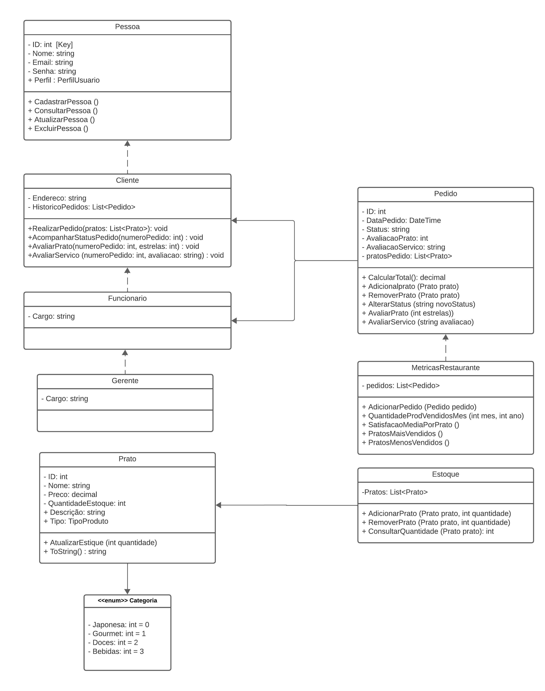
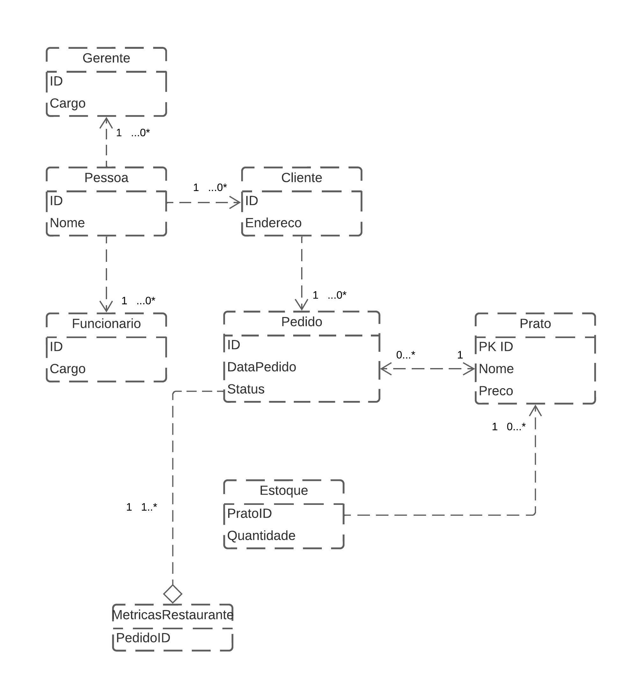

# Arquitetura da Solução

## Diagrama de Classes

O diagrama de classes ilustra graficamente como será a estrutura do software, e como cada uma das classes da sua estrutura estarão interligadas. Essas classes servem de modelo para materializar os objetos que executarão na memória.

A **classe Pessoa** contém atributos comuns a todas as pessoas, como ID e Nome, e possui um construtor que inicializa esses atributos.

As **classes Cliente**, **Funcionário** e **Gerente** herdam da **classe Pessoa**. Elas também possuem atributos específicos para cada tipo de pessoa, como Endereco para clientes e Cargo para funcionários e gerentes. Os construtores dessas classes chamam o construtor da classe base Pessoa usando base(id, nome) para inicializar os atributos comuns.

As funções do **Cliente** são:
* RealizarPedido(List<Prato> pratos): Permite que o cliente faça um pedido online, passando a lista de pratos desejados.
* AcompanharStatusPedido(int numeroPedido): Permite que o cliente acompanhe o status de um pedido específico usando o número do pedido.
* AvaliarPrato(int numeroPedido, int estrelas): Permite ao cliente avaliar um prato em um pedido específico, atribuindo um número de estrelas.
* AvaliarServico(int numeroPedido, string avaliacao): Permite ao cliente avaliar o serviço prestado no pedido com um texto.

As funções do **Funcionário** são:
* AcompanharPedidos(List<Pedido> pedidos): Permite ao funcionário acompanhar a lista de pedidos feitos pelos clientes.
* AtualizarStatusPedido(Pedido pedido, string novoStatus): Permite ao funcionário atualizar o status de um pedido, indicando se está em preparação, pronto para entrega, entregue, etc.

As funções do **Gerente** são:
* GerarRelatorioFinanceiro(DateTime dataInicio, DateTime dataFim): Gera um relatório financeiro com base em um intervalo de datas específico.
* CadastrarPrato(Prato novoPrato): Permite ao gerente cadastrar um novo prato no menu do restaurante.
* DescadastrarPrato(Prato pratoExistente): Permite ao gerente remover um prato do menu do restaurante.
* GerarRelatorioEstoque(): Gera um relatório do estoque atual do restaurante.

As funções da classe **Pedido** são:
* CalcularTotal(): Calcula o total do pedido com base nos preços dos pratos selecionados.
* AdicionarPrato(Prato prato): Adiciona um prato ao pedido.
* RemoverPrato(Prato prato): Remove um prato do pedido.
* AlterarStatus(string novoStatus): Altera o status do pedido.
* AvaliarPrato(int estrelas): Permite ao cliente avaliar um prato no pedido.
* AvaliarServico(string avaliacao): Permite ao cliente avaliar o serviço prestado no pedido.

As funções da classe **Prato** são:
* AtualizarEstoque(int quantidade): Atualiza a quantidade disponível no estoque após a preparação de um pedido.
* ToString(): Retorna uma representação em string do prato, que pode ser usada para exibir informações do prato no menu.

As funções da classe **Estoque** são:
* AdicionarPrato(Prato prato, int quantidade): Adiciona uma quantidade especificada de um prato ao estoque.
* RemoverPrato(Prato prato, int quantidade): Remove uma quantidade especificada de um prato do estoque.
* ConsultarQuantidade(Prato prato): Retorna a quantidade disponível de um prato no estoque.

A **classe MetricasRestaurante** possui uma lista privada de pedidos para armazenar todos os pedidos feitos no restaurante. As suas funções são:
* AdicionarPedido: permite adicionar um pedido à lista de pedidos.
* QuantidadeProdutosVendidosNoMes: calcula a quantidade total de produtos vendidos no mês e ano especificados.
* SatisfacaoMediaPorPrato: calcula a satisfação média do cliente com cada prato com base nas avaliações dos clientes.
* PratosMaisVendidos e PratosMenosVendidos: retornam listas de pratos ordenados por quantidade vendida, de forma descendente e ascendente, respectivamente.

## Modelo ER

## Esquema Relacional

Neste modelo conceitual
* Pessoa é uma entidade pai com uma relação de herança para as entidades Cliente, Funcionario e Gerente.
* Pedido tem uma relação com Cliente para indicar quem fez o pedido.
* Prato representa os pratos disponíveis, e Estoque controla a quantidade de cada prato disponível.
* MetricasRestaurante está relacionado com Pedido para calcular métricas relacionadas aos pedidos.

**Quanto à cardinalidade**
* Pessoa - Cliente, Pessoa - Funcionário, Pessoa - Gerente:

* A relação entre Pessoa (pai) e Cliente (filho) é uma relação "1 para 0 ou mais". Isso significa que uma pessoa pode ser um cliente ou nenhum cliente, e um cliente é uma pessoa.
* A relação entre Pessoa (pai) e Funcionário (filho) também é "1 para 0 ou mais". Isso significa que uma pessoa pode ser um funcionário ou nenhum funcionário, e um funcionário é uma pessoa.
* A relação entre Pessoa (pai) e Gerente (filho) também pode ser "1 para 0 ou mais" ou "1 para 1 ou mais". Isso significa que uma pessoa pode ser um gerente ou nenhum gerente, e um gerente é uma pessoa.

* Cliente - Pedido:
A relação entre Cliente e Pedido é "1 para 0 ou mais". Isso significa que um cliente pode fazer um ou mais pedidos, mas também pode não fazer nenhum pedido. Um pedido pertence a um único cliente.

* Pedido - Prato:
A relação entre Pedido e Prato é "Muitos para Muitos" (M:N), o que significa que um pedido pode conter muitos pratos, e um prato pode estar em muitos pedidos. Isso é comum em sistemas de pedidos de restaurantes, onde um pedido pode incluir vários pratos diferentes, e um prato pode ser solicitado em vários pedidos.

* Estoque - Prato:
A relação entre Estoque e Prato é "1 para 0 ou mais". Isso significa que um prato pode estar no estoque em uma quantidade específica, e pode haver vários pratos diferentes no estoque. Cada prato no estoque está relacionado a um único prato.

* MetricasRestaurante - Pedido:
A relação entre MetricasRestaurante e Pedido é "1 para 1 ou mais". Isso significa que um conjunto de métricas pode estar relacionado a um ou mais pedidos. Cada métrica está relacionada a um único pedido.

> - [Criando um modelo relacional - Documentação da IBM](https://www.ibm.com/docs/pt-br/cognos-analytics/10.2.2?topic=designer-creating-relational-model)

## Modelo Físico

Entregar um arquivo banco.sql contendo os scripts de criação das tabelas do banco de dados. Este arquivo deverá ser incluído dentro da pasta src\bd.

## Tecnologias Utilizadas
### Implementação Web API Rest

O projeto foi idealizado utilizando a plataforma de desenvolvimento .NET Framework, escolhendo-se esse pacote de soluções devido à sua acessibilidade e ao conjunto abrangente de ferramentas que oferece para facilitar a implementação da solução em questão. O código-fonte do nosso sistema de gerenciamento, denominado DriveXpress, está hospedado no repositório Github/DriveXpress. 

A seguir, fornecemos um resumo conciso das escolhas das ferramentas adotadas no desenvolvimento desta solução, incluindo detalhes sobre a estrutura de desenvolvimento, perspectivas de implementação e a justificativa das tecnologias selecionadas. 

#### Escopo da solução: Documentação da arquitetura, configuração do ambiente, modelagem dos dados, autenticação, recursos e rotas.

O projeto foi concebido no ambiente de desenvolvimento Visual Studio Community, utilizando a linguagem de programação C# como base. A escolha dessa IDE foi motivada pela ampla gama de funcionalidades e ferramentas disponíveis, que simplificam a criação de uma API destinada a um sistema de gerenciamento de restaurantes operando no modelo de Drive-Thru.   

No que diz respeito à modelagem de dados, aproveitamos as capacidades oferecidas pelo pacote Microsoft Entity Framework, um ORM (Object-Relational Mapping) que facilita a criação e organização de um banco de dados relacional, garantindo uma estrutura eficiente e escalável.  

Para a implementação da autenticação de usuário no sistema, recorremos ao pacote BCrypt, que fornece recursos essenciais para criptografar as senhas armazenadas no sistema, assegurando a segurança das informações dos usuários.  

No âmbito da criação de rotas, adotamos protocolos de requisição HTTP, incluindo GET, POST, PUT e DELETE, para desenvolver um sistema de CRUD, abrangendo funcionalidades relacionadas a usuários, restaurantes, produtos do cardápio e pedidos realizados pelos clientes ao fazer uso da plataforma DriveXpress. Esse conjunto de recursos permitirá uma interação dinâmica e eficaz com o sistema, oferecendo uma experiência completa aos usuários e proprietários de restaurantes. 

#### Armazenamento de dados – Sistema DriveXpress 

O sistema DriveXpress utiliza o Entity Framework, um ORM com base no SQL Server, para gerenciar eficazmente os dados. Ele incorpora uma série de funcionalidades para manipular informações fornecidas pelos usuários, abrangendo a criação, atualização, exclusão e consulta de dados registrados no sistema.  

No que se refere às operações relacionadas a restaurantes, os usuários podem gerenciar informações essenciais, incluindo nome, e-mail, telefone, endereço, categoria de atuação, produtos oferecidos, clientes cadastrados e pedidos. Além disso, o sistema permite realizar tarefas como a atualização, exclusão e consulta desses dados.  

Para a gestão de informações de usuários, é possível criar novos perfis com nome, e-mail, senha e especificar o perfil de usuário (cliente, funcionário ou gerente). O sistema impõe restrições de acesso de acordo com o perfil, garantindo que os usuários tenham acesso apenas às informações apropriadas. Da mesma forma, é possível atualizar, excluir e consultar dados de usuários.   

No que diz respeito ao cardápio, funcionários podem cadastrar produtos, incluindo nome do prato, quantidade, descrição, valor unitário e tipo (comida, bebida, sobremesa). Além disso, é especificado qual restaurante oferece cada produto. O sistema oferece ferramentas para atualizar, excluir e consultar esses dados de forma eficiente. 

Além disso, o sistema permite o registro de informações sobre os produtos incluídos em um pedido, solicitando detalhes como nome do usuário, descrição do pedido, quantidade, valor total do pedido e restaurante. As mesmas ferramentas de atualização, exclusão e consulta são disponibilizadas para esses dados.  

Em resumo, o sistema DriveXpress oferece uma variedade de funcionalidades abrangentes e amigáveis para que usuários possam administrar informações relacionadas a restaurantes, clientes, cardápios e pedidos, proporcionando uma experiência completa de gerenciamento de restaurantes de maneira eficiente e intuitiva. 

#### Ferramentas de desenvolvimento e suas funcionalidades 

Optou-se pelo ambiente de desenvolvimento .Net Core para a criação da solução de gerenciamento DriveThru, conhecida como DriveXpress, devido ao amadurecimento do framework e às facilidades oferecidas por meio de ferramentas de manipulação de dados, como o ORM Entity Framework, e recursos de criptografia de senhas, como o BCrypt. Além disso, a abundante documentação disponível na internet e no site oficial da Microsoft contribuíram para essa escolha. 

Quanto à definição dos parâmetros para a construção do aplicativo DriveXpress, foi adotada uma abordagem que combina informações sobre as entidades que compõem a solução. Essa estratégia visa assegurar a confiabilidade e robustez do sistema para todas as partes envolvidas, incluindo usuários, restaurantes, produtos e pedidos. Essa composição de dados cuidadosamente planejada é fundamental para o funcionamento sólido e eficaz do sistema, proporcionando uma experiência confiável e satisfatória para todos os usuários e stakeholders. 

.
.
.
.
.
.

### Notas: apagar quando concluído
Apresente também uma figura explicando como as tecnologias estão relacionadas ou como uma interação do usuário com o sistema vai ser conduzida, por onde ela passa até retornar uma resposta ao usuário.

## Hospedagem

Explique como a hospedagem e o lançamento da plataforma foi feita.

> **Links Úteis**:
>
> - [Website com GitHub Pages](https://pages.github.com/)
> - [Programação colaborativa com Repl.it](https://repl.it/)
> - [Getting Started with Heroku](https://devcenter.heroku.com/start)
> - [Publicando Seu Site No Heroku](http://pythonclub.com.br/publicando-seu-hello-world-no-heroku.html)

## Qualidade de Software

Conceituar qualidade de fato é uma tarefa complexa, mas ela pode ser vista como um método gerencial que através de procedimentos disseminados por toda a organização, busca garantir um produto final que satisfaça às expectativas dos stakeholders.

No contexto de desenvolvimento de software, qualidade pode ser entendida como um conjunto de características a serem satisfeitas, de modo que o produto de software atenda às necessidades de seus usuários. Entretanto, tal nível de satisfação nem sempre é alcançado de forma espontânea, devendo ser continuamente construído. Assim, a qualidade do produto depende fortemente do seu respectivo processo de desenvolvimento.

A norma internacional ISO/IEC 25010, que é uma atualização da ISO/IEC 9126, define oito características e 30 subcaracterísticas de qualidade para produtos de software.
Com base nessas características e nas respectivas sub-características, identifique as sub-características que sua equipe utilizará como base para nortear o desenvolvimento do projeto de software considerando-se alguns aspectos simples de qualidade. Justifique as subcaracterísticas escolhidas pelo time e elenque as métricas que permitirão a equipe avaliar os objetos de interesse.

> **Links Úteis**:
>
> - [ISO/IEC 25010:2011 - Systems and software engineering — Systems and software Quality Requirements and Evaluation (SQuaRE) — System and software quality models](https://www.iso.org/standard/35733.html/)
> - [Análise sobre a ISO 9126 – NBR 13596](https://www.tiespecialistas.com.br/analise-sobre-iso-9126-nbr-13596/)
> - [Qualidade de Software - Engenharia de Software 29](https://www.devmedia.com.br/qualidade-de-software-engenharia-de-software-29/18209/)
