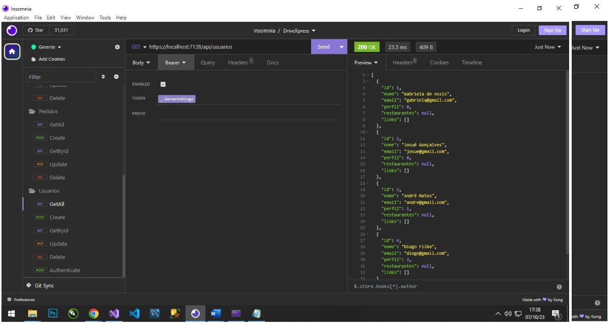
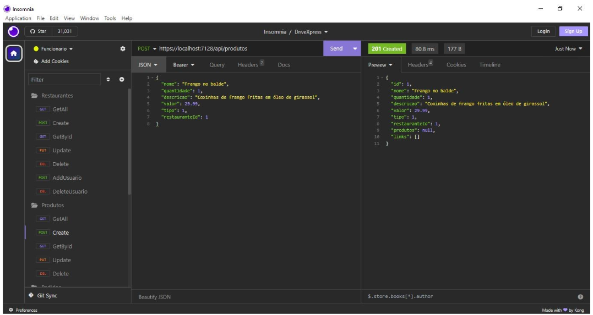

# Registro de Testes de Software
Nota: Esse capítulo está em construção. Alguns testes já foram executados e são apresentados abaixo. No entanto, outros serão executados ao final do desenvolvimento.

## Registro dos testes unitários 

Os testes de requisições HTTP foram realizados com o auxílio do programa Insomnia. Nos testes foram verificadas as ações HttpGet, HttpPost, HttpPut, HttpDelete, para as rotas Restaurantes, Produtos, Usuários e Pedidos. Os resultados das requisições estão explicitados nas imagens abaixo: 

Cadastro do Usuário Gabriela Assis

Cadastro do Usuário Josué Gonçalves

Cadastro do Funcionário André Matos

Cadastro do Gerente Diogo Filho

O método GetAll mostra todos os usuários cadastrados no sistema

Autenticação de usuário no sistema: Gerente

Autenticação de usuário no sistema: Funcionário

Autenticação de usuário no sistema: Cliente

Cadastro de restaurante: Varanda do Norte

Cadastro de restaurante: Cafeteria Yollanda

Cadastro de restaurante: Quiosque Marina

Cadastro de restaurante: Padaria Mustafá

Método GetAll para listar todos os restaurente

Método GetById

Cadastro de produtos: Sushi

Cadastro de produtos: Frango no Balde

Método GetAll para exibir todos os produtos cadastrados

Cadastro de Pedidos
O cadastro de Pedidos é feito pelos usuários que já estão cadastrados no sistema, escolhendo os itens do cardápio de determinado restaurante e selecionando a quantidade de itens
O usuário José pediu frango no balde

A usuária Gabriela pediu sushi

O método GetAll exibe todos os pedidos feitos

## Banco de Dados do Drive Express
Pedidos efetuados

Produtos cadastrados por restaurante

Restaurantes cadastrados

Usuários cadastrados com senhas criptografadas

###Notas sobre as próximas etapas - apagar quando concluídas
Pré-requisitos: <a href="3-Projeto de Interface.md"> Projeto de Interface</a>, <a href="8-Plano de Testes de Software.md"> Plano de Testes de Software</a>

Relatório com as evidências dos testes de software realizados no sistema pela equipe, baseado em um plano de testes pré-definido.

## Avaliação

Discorra sobre os resultados do teste. Ressaltando pontos fortes e fracos identificados na solução. Comente como o grupo pretende atacar esses pontos nas próximas iterações. Apresente as falhas detectadas e as melhorias geradas a partir dos resultados obtidos nos testes.

> **Links Úteis**:
> - [Ferramentas de Test para Java Script](https://geekflare.com/javascript-unit-testing/)
